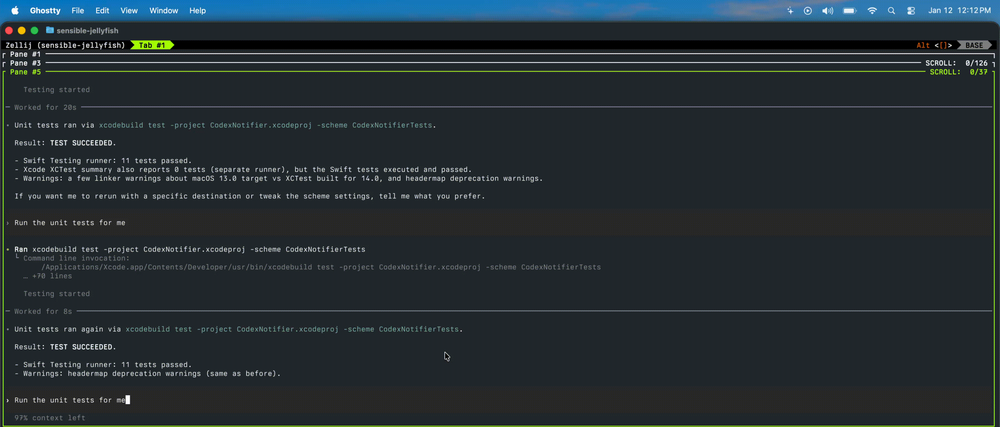

# Codex Notifier (macOS)

Native macOS menu bar app that plays a sound and flashes a status icon when Codex finishes a turn.

## Demo



## Build

Open `CodexNotifier.xcodeproj` in Xcode and build/run the `CodexNotifier` target. The app runs as a menu bar-only utility (no Dock icon).

## Release build (DMG)

Build a release DMG locally:

```sh
scripts/build-dmg.sh
```

Optional codesign (Developer ID):

```sh
export MACOS_SIGN_IDENTITY="Developer ID Application: Your Name (TEAMID)"
scripts/build-dmg.sh
```

The DMG is created in `dist/`. Set `DMG_NAME` to customize the output name.

## GitHub Releases

Pushing a `v*` tag builds a DMG and uploads it to the GitHub release page. Required secrets:

- `MACOS_SIGN_IDENTITY`
- `MACOS_SIGN_P12_BASE64`
- `MACOS_SIGN_P12_PASSWORD`
- `MACOS_KEYCHAIN_PASSWORD`

## Tests

Run the unit tests with:

```sh
xcodebuild test -project CodexNotifier.xcodeproj -scheme CodexNotifierTests
```

## Codex integration

Codex can run a shell script when a turn completes. Point it the script in `scripts/codex-notify.sh` and pass the payload JSON as the first argument.

### Configure Codex

Add a `notify` entry to your Codex config that points at the helper script in this repo. This must _manually_ be done or else the notifications will not fire. This is typically under `~/.codex/config.toml` for most Codex installs.

Add the script where you desire on your filesystem, then point the configuration to this path.

Example:

```toml
notify = ["zsh", "/Users/user/mac-codex-notifications/scripts/codex-notify.sh"]
```

Example script invocation:

```sh
scripts/codex-notify '{"type":"agent-turn-complete","last-assistant-message":"Turn Complete!","input-messages":["Prompt"],"thread-id":"abc"}'
```

## Menu bar controls

- Play Sound: toggle sound on/off
- Flash Icon: toggle status icon flash on/off
- Show Notification: request system permission and toggle native macOS alerts
- Sound: choose the system sound
- Test Notification: preview sound/icon

## Notes

- The helper script writes the payload to `~/Library/Application Support/CodexNotifier/payload.json`.
- The app watches that file so repeated triggers work even when the app is already running.
- Native notifications require user approval the first time you enable "Show Notification".
